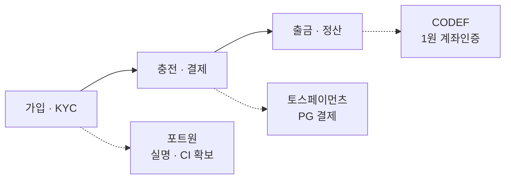

# 외부 연동 API (샌드박스 기준)

> 2026-07-02 · 모든 값은 **테스트/샌드박스** 기준이다. 운영 전환 시 키·도메인·채널을 교체하고 재검증할 것.
> 배경: [결제·정산 모델 비교노트](../payment-model-comparison.html) — 어느 결제모델을 택하느냐에 따라 아래 연동의 사용 범위가 달라진다.

이 서비스가 검토 중인 외부 연동 3종의 **샌드박스 호출방식**을 정리한다. (근거: `review/2026-07-01/minjoon.md` + 각 벤더 공식 문서)

| API | 역할 | 문서 |
|---|---|---|
| **토스페이먼츠** | 카드·간편결제 PG (결제·정산) | [toss-payments](toss-payments.html) |
| **CODEF** | 1원 계좌인증 (예금주 확인 + 점유인증) | [codef](codef.html) |
| **포트원 본인인증** | PASS 실명·CI 확보 (KYC·1인 1계정) | [portone-identity](portone-identity.html) |

## 어디에 쓰이나

자금 여정의 세 지점에 각 연동이 대응한다.

## 공통 원칙 (어느 연동이든)

- **서버 검증 필수**: 프론트/리다이렉트로 온 값(금액·인증결과)은 위·변조 가능 → 반드시 서버에서 재조회·재검증한 뒤 비즈니스 로직을 실행한다.
- **시크릿은 서버에만**: `test_sk_...`, API Secret, `clientSecret` 등은 클라이언트 번들에 포함하지 않는다.
- **멱등성**: 주문/요청 식별자(예: `orderId`)로 중복 처리(중복 승인·이중 발행)를 방지한다.
- **샌드박스 데이터 한계**: 테스트 환경은 실제 결제·실명·계좌가 아니며(랜덤/가상 데이터) 운영 채널로 전환한 뒤 재검증해야 한다.
