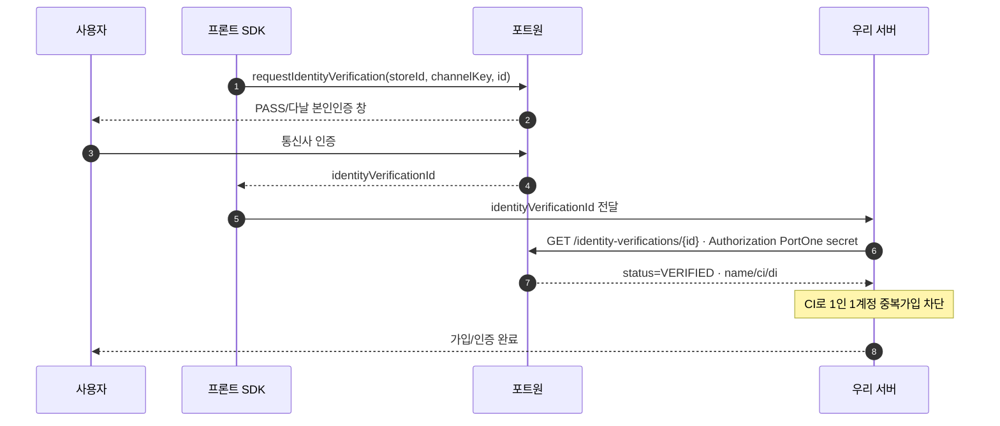

# 포트원 (PortOne) 본인인증 — 샌드박스

> 샌드박스 기준 · 2026-07-02 · 테스트 채널은 실제 개인정보가 아님 → 운영 채널로 전환·재검증. 근거: 공식 문서(하단 링크).

## 목적/역할

본 서비스에서 포트원 본인인증은 **실명(성명·생년월일) + CI(연계정보) 확보**, **CI 기반 1인 1계정(중복가입 차단)**, 최소 **KYC(본인 확인)** 목적이다. 통신사(SKT/KT/LGU+/알뜰폰) 또는 다날 PASS 등으로 실사용자 본인 여부를 검증하고 CI/DI를 가입·중복차단 로직에 활용한다.

## 버전

- **V2 (권장)**: 브라우저 SDK `PortOne.requestIdentityVerification()` → `identityVerificationId` 발급 → 서버 REST 단건 조회로 검증. (아래 흐름 = V2)
- **V1 (구 아임포트, 레거시)**: `IMP.certification({ channelKey, merchant_uid, m_redirect_url }, cb)` → 콜백 `imp_uid` → 서버 `POST https://api.iamport.kr/users/getToken`(토큰) 후 `GET https://api.iamport.kr/certifications/{imp_uid}`. 응답 `unique_key`=CI, `unique_in_site`=DI. **신규 연동은 V2 권장.**

## 샌드박스 준비물

1. **포트원 가입 및 콘솔 로그인**(무료, 별도 계약 불필요).
2. **테스트 본인인증 채널 추가**: 콘솔 `[결제 연동] → [연동 관리] → [채널 관리]` → 연동 모드 **테스트** → PG(예: 다날) 선택 → 채널 속성 **본인인증** → 공용 테스트 상점(MID) 제공 PG는 자동 채움 → 저장.
3. **Store ID 확인**: `[결제 연동] → [연동 관리]`에서 상점 아이디 복사(`storeId`에 사용).
4. **V2 API Secret 발급**: `[연동 관리] → [식별코드·API Keys] → [V2 API]`(Owner/Admin). 발급 직후에만 값 확인 가능 → 즉시 보관.
5. **channelKey 확인**: 추가한 테스트 채널의 채널 키.

## 호출 흐름 (단계별)

전체 흐름을 시퀀스로 먼저 본 뒤, 아래 단계 설명을 참고한다.



1. **프론트: SDK 본인인증 요청**
   ```js
   const response = await PortOne.requestIdentityVerification({
     storeId: "store-xxxx-...",
     identityVerificationId: `identity-verification-${crypto.randomUUID()}`,
     channelKey: "channel-key-xxxx-...",     // 테스트(샌드박스) 채널 키
     // redirectUrl: `${BASE_URL}/identity-verification-redirect`,  // 모바일 리다이렉트 방식
   });
   if (response.code !== undefined) { /* 인증 오류 처리 */ }
   ```
   `identityVerificationId`는 건별 식별자(재시도 가능, 최종 성공은 1회).
2. **identityVerificationId 수신** — 팝업: 반환값으로 획득 / 모바일 redirect: `redirectUrl`에 `?identityVerificationId=...`. 이 값을 서버로 전달(신뢰 대상 아님).
3. **서버 조회·검증 (필수)**
   ```
   GET https://api.portone.io/identity-verifications/{identityVerificationId}
   Authorization: PortOne {API_SECRET}
   ```
   응답 `status`가 `VERIFIED`인지 **서버에서 반드시 확인**.
4. **verifiedCustomer 획득** — `status = VERIFIED`일 때 `name`·`ci`·`di`·`gender`·`birthDate`·`phoneNumber`·`operator`·`isForeigner` 등을 추출해 가입/중복차단에 사용.

## 핵심 엔드포인트

| Method | URL | 인증 | 주요 필드 |
|---|---|---|---|
| GET | `https://api.portone.io/identity-verifications/{identityVerificationId}` | `Authorization: PortOne {API_SECRET}` | 응답 `status`(`READY`\|`FAILED`\|`VERIFIED`), `verifiedCustomer.{name,ci,di,...}` |
| POST | `…/identity-verifications/{id}/send` | 동일 | API 방식(SMS/APP) 본인인증 요청 전송 |
| POST | `…/identity-verifications/{id}/confirm` | 동일 | OTP 등 확인 처리 |

## 요청/응답 예시

```bash
curl --request GET \
  --url "https://api.portone.io/identity-verifications/identity-verification-39ecfa97" \
  --header "Authorization: PortOne ${PORTONE_API_SECRET}"
```

```json
{
  "status": "VERIFIED",
  "id": "identity-verification-39ecfa97",
  "verifiedCustomer": {
    "name": "홍길동",
    "ci": "F1QavPWtCLzOHc0k4unGZFAzYij0Fw4jz1UkFI0OGvIiJd9wj0YtAFAjssgNMZq1",
    "di": "5f3e2c9b1a4d..."
  }
}
```

## 주의점

- **CI로 중복가입 차단**: CI는 사람마다 고유하고 서비스 간 연계·중복 판별에 사용. DI는 자사 내에서만 고유(자사 중복체크용). 제공 여부는 PG·계약에 따름.
- **테스트 채널은 실제 개인정보 아님**: 테스트 모드는 실명/CI가 아닌 테스트 값 → 운영 배포 전 실연동 채널로 전환·재검증.
- **서버 검증 필수**: SDK 반환값·redirect 쿼리스트링은 위·변조 가능 → 서버에서 `GET /identity-verifications/{id}`로 `status === "VERIFIED"` 재확인 후 비즈니스 로직.
- **API Secret 보호**: 서버에서만 사용, 클라이언트 노출 금지.

## 공식 문서

- [본인인증 연동하기(V2)](https://developers.portone.io/opi/ko/extra/identity-verification/readme-v2?v=v2)
- [다날 본인인증 연동](https://developers.portone.io/opi/ko/integration/pg/v2/danal-identity-verification?v=v2)
- [연동 준비(Store ID/API Secret·테스트 채널)](https://developers.portone.io/opi/ko/integration/ready/readme?v=v2)
- [REST API V2 — 본인인증](https://developers.portone.io/api/rest-v2/identityVerification?v=v2)
- [V1 휴대폰 본인인증](https://developers.portone.io/opi/ko/extra/identity-verification/v1/readme?v=v1)
