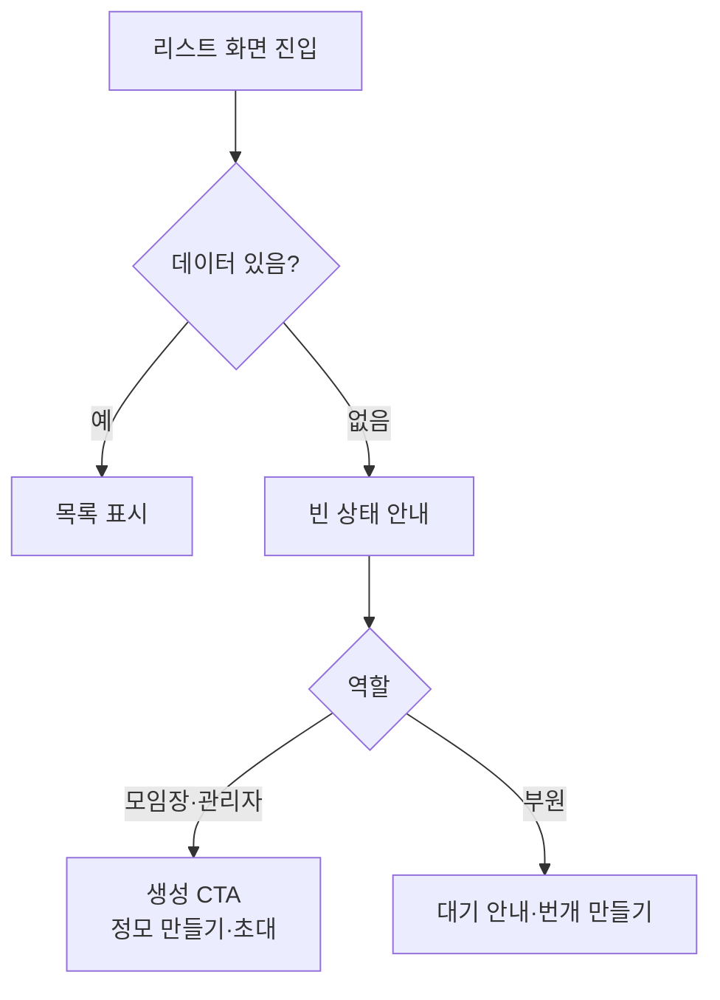

# 빈_상태 — wireflow (lo-fi)

```mermaid
flowchart TD
  S[리스트 화면 진입] --> Q{데이터 있음?}
  Q -->|예| L[목록 표시]
  Q -->|없음| E[빈 상태 안내]
  E --> R{역할}
  R -->|모임장·관리자| C1[생성 CTA<br/>정모 만들기·초대]
  R -->|부원| C2[대기 안내·번개 만들기]
```
