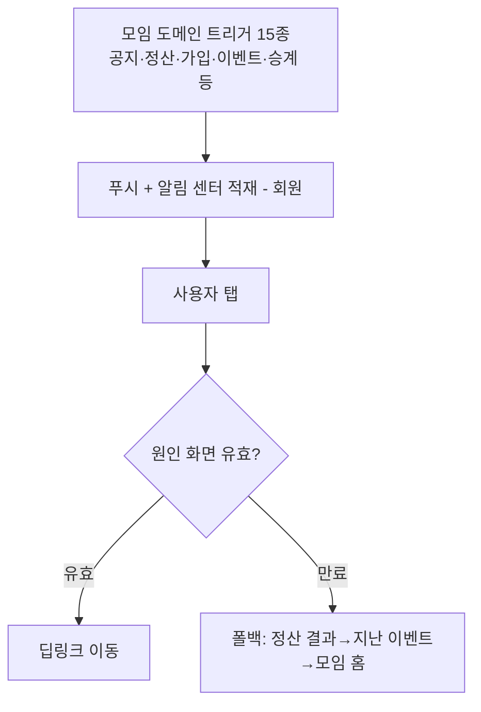

# 알림(모임 트리거) — wireflow (lo-fi)

```mermaid
flowchart TD
  T[모임 도메인 트리거 15종<br/>공지·정산·가입·이벤트·승계 등] --> P[푸시 + 알림 센터 적재 - 회원]
  P --> U[사용자 탭] --> DL{원인 화면 유효?}
  DL -->|유효| GO[딥링크 이동]
  DL -->|만료| FB[폴백: 정산 결과→지난 이벤트→모임 홈]
```
