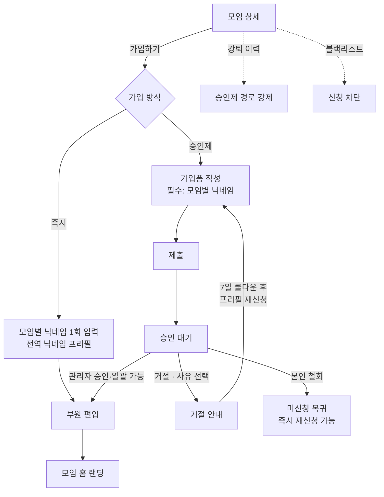

# 모임_가입 — wireflow (lo-fi)

```mermaid
flowchart TD
  A[모임 상세] -->|가입하기| B{가입 방식}
  B -->|즉시| N[모임별 닉네임 1회 입력<br/>전역 닉네임 프리필] --> M[부원 편입] --> H[모임 홈 랜딩]
  B -->|승인제| F[가입폼 작성<br/>필수: 모임별 닉네임] --> S[제출] --> P[승인 대기]
  P -->|관리자 승인·일괄 가능| M
  P -->|거절 · 사유 선택| R[거절 안내] -->|7일 쿨다운 후<br/>프리필 재신청| F
  P -->|본인 철회| Z[미신청 복귀<br/>즉시 재신청 가능]
  A -.->|강퇴 이력| B2[승인제 경로 강제]
  A -.->|블랙리스트| X[신청 차단]
```
