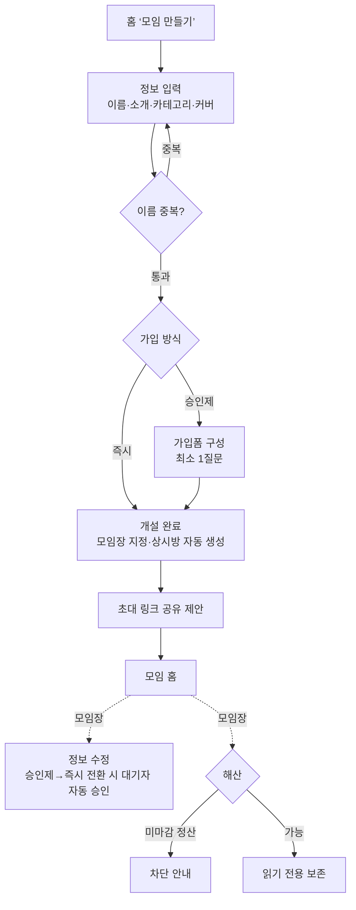

# 모임_개설 — wireflow (lo-fi)

```mermaid
flowchart TD
  S[홈 ‘모임 만들기’] --> F[정보 입력<br/>이름·소개·카테고리·커버]
  F --> U{이름 중복?} -->|중복| F
  U -->|통과| G{가입 방식}
  G -->|즉시| DONE
  G -->|승인제| FB[가입폼 구성<br/>최소 1질문] --> DONE[개설 완료<br/>모임장 지정·상시방 자동 생성]
  DONE --> IV[초대 링크 공유 제안] --> H[모임 홈]
  H -.->|모임장| ED[정보 수정<br/>승인제→즉시 전환 시 대기자 자동 승인]
  H -.->|모임장| DEL{해산} -->|미마감 정산| BLK[차단 안내]
  DEL -->|가능| RO[읽기 전용 보존]
```
