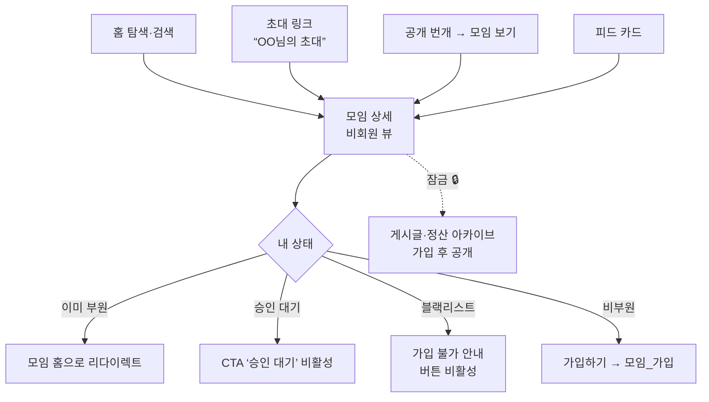

# 모임_둘러보기 — wireflow (lo-fi)

```mermaid
flowchart TD
  IN1[홈 탐색·검색] --> D[모임 상세<br/>비회원 뷰]
  IN2[초대 링크<br/>“OO님의 초대”] --> D
  IN3[공개 번개 → 모임 보기] --> D
  IN4[피드 카드] --> D
  D --> C{내 상태}
  C -->|이미 부원| H[모임 홈으로 리다이렉트]
  C -->|승인 대기| W[CTA ‘승인 대기’ 비활성]
  C -->|블랙리스트| X[가입 불가 안내<br/>버튼 비활성]
  C -->|비부원| J[가입하기 → 모임_가입]
  D -.->|잠금 🔒| L[게시글·정산 아카이브<br/>가입 후 공개]
```
