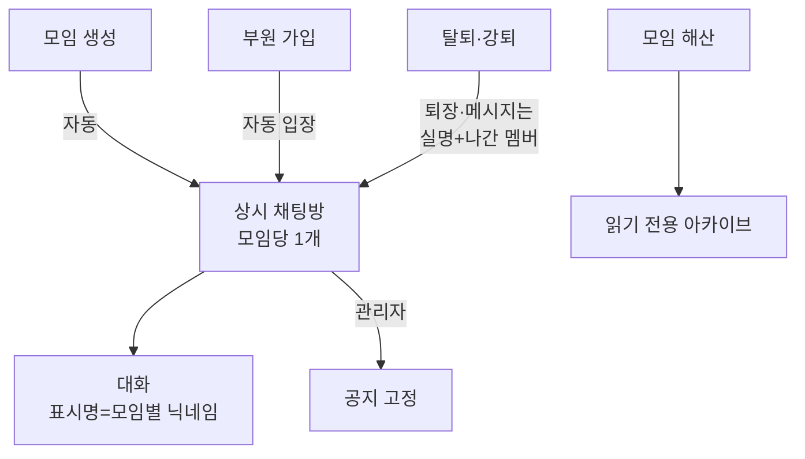

# 모임_채팅(상시방) — wireflow (lo-fi)

```mermaid
flowchart TD
  C[모임 생성] -->|자동| R[상시 채팅방<br/>모임당 1개]
  J[부원 가입] -->|자동 입장| R
  R --> T[대화<br/>표시명=모임별 닉네임]
  R -->|관리자| N[공지 고정]
  L[탈퇴·강퇴] -->|퇴장·메시지는<br/>실명+나간 멤버| R
  D[모임 해산] --> RO[읽기 전용 아카이브]
```
