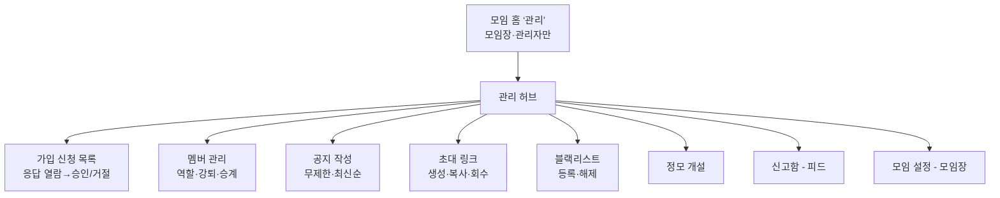

# 운영_관리 — wireflow (lo-fi)

```mermaid
flowchart TD
  H[모임 홈 ‘관리’<br/>모임장·관리자만] --> HUB[관리 허브]
  HUB --> JR[가입 신청 목록<br/>응답 열람→승인/거절]
  HUB --> MB[멤버 관리<br/>역할·강퇴·승계]
  HUB --> NT[공지 작성<br/>무제한·최신순]
  HUB --> IV[초대 링크<br/>생성·복사·회수]
  HUB --> BL[블랙리스트<br/>등록·해제]
  HUB --> EV[정모 개설]
  HUB --> RP[신고함 - 피드]
  HUB --> ST[모임 설정 - 모임장]
```
