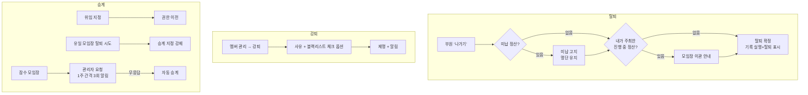

# 탈퇴_강퇴_승계 — wireflow (lo-fi)

```mermaid
flowchart TD
  subgraph 탈퇴
    A[부원 ‘나가기’] --> B{미납 정산?} -->|있음| C[미납 고지<br/>명단 유지]
    B -->|없음| D
    C --> D{내가 주최한<br/>진행 중 정산?} -->|있음| E[모임장 이관 안내]
    D -->|없음| F[탈퇴 확정<br/>기록 실명+탈퇴 표시]
    E --> F
  end
  subgraph 강퇴
    G[멤버 관리 → 강퇴] --> H[사유 + 블랙리스트 체크 옵션] --> I[제명 + 알림]
  end
  subgraph 승계
    J[위임 지정] --> K[권한 이전]
    L[유일 모임장 탈퇴 시도] --> M[승계 지정 강제]
    N[잠수 모임장] --> O[관리자 요청<br/>1주 간격 3회 알림] -->|무응답| P[자동 승계]
  end
```
