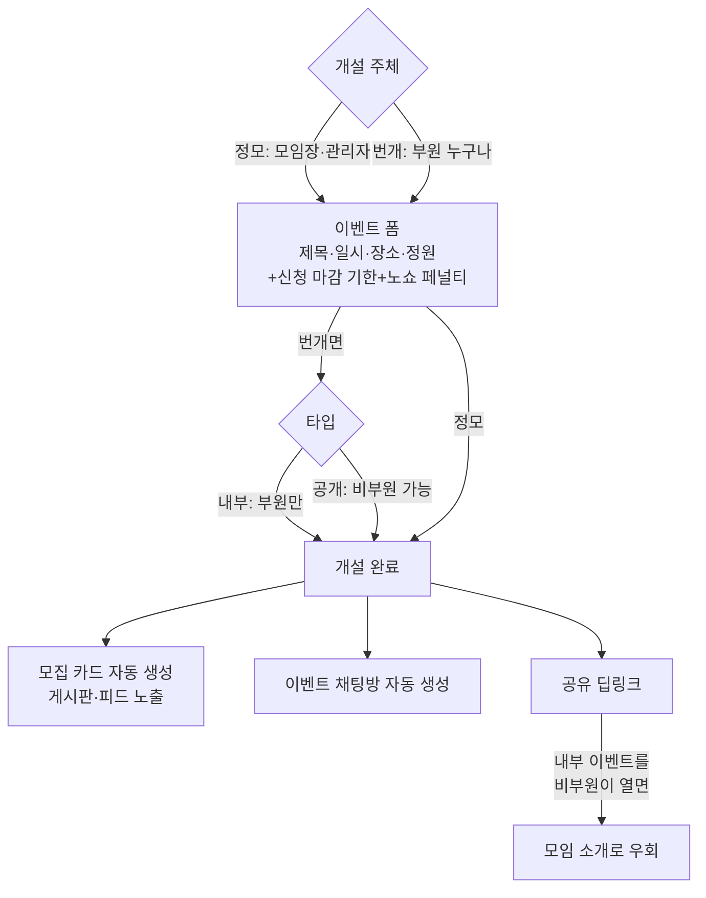

# 정모_번개_개설 — wireflow (lo-fi)

```mermaid
flowchart TD
  S{개설 주체} -->|정모: 모임장·관리자| F
  S -->|번개: 부원 누구나| F[이벤트 폼<br/>제목·일시·장소·정원<br/>+신청 마감 기한+노쇼 페널티]
  F -->|번개면| T{타입} -->|내부: 부원만| C
  T -->|공개: 비부원 가능| C[개설 완료]
  F -->|정모| C
  C --> K[모집 카드 자동 생성<br/>게시판·피드 노출]
  C --> R[이벤트 채팅방 자동 생성]
  C --> SH[공유 딥링크]
  SH -->|내부 이벤트를<br/>비부원이 열면| U[모임 소개로 우회]
```
