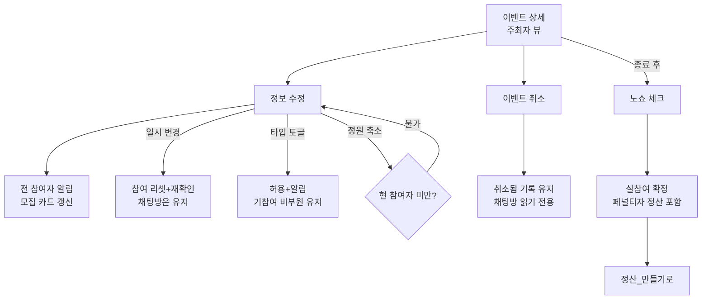

# 정모_번개_관리 — wireflow (lo-fi)

```mermaid
flowchart TD
  H[이벤트 상세<br/>주최자 뷰] --> E[정보 수정] --> N[전 참여자 알림<br/>모집 카드 갱신]
  E -->|일시 변경| RS[참여 리셋+재확인<br/>채팅방은 유지]
  E -->|타입 토글| TT[허용+알림<br/>기참여 비부원 유지]
  E -->|정원 축소| LM{현 참여자 미만?} -->|불가| E
  H --> CA[이벤트 취소] --> CC[취소됨 기록 유지<br/>채팅방 읽기 전용]
  H -->|종료 후| NS[노쇼 체크] --> FIX[실참여 확정<br/>페널티자 정산 포함] --> STL[정산_만들기로]
```
