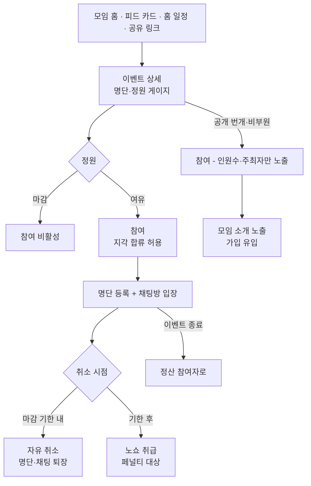

# 정모_번개_참여 — wireflow (lo-fi)

```mermaid
flowchart TD
  IN[모임 홈 · 피드 카드 · 홈 일정 · 공유 링크] --> D[이벤트 상세<br/>명단·정원 게이지]
  D --> Q{정원} -->|마감| X[참여 비활성]
  Q -->|여유| J[참여<br/>지각 합류 허용] --> L[명단 등록 + 채팅방 입장]
  D -->|공개 번개·비부원| P[참여 - 인원수·주최자만 노출] --> G[모임 소개 노출<br/>가입 유입]
  L --> CX{취소 시점} -->|마감 기한 내| C1[자유 취소<br/>명단·채팅 퇴장]
  CX -->|기한 후| C2[노쇼 취급<br/>페널티 대상]
  L -->|이벤트 종료| ST[정산 참여자로]
```
