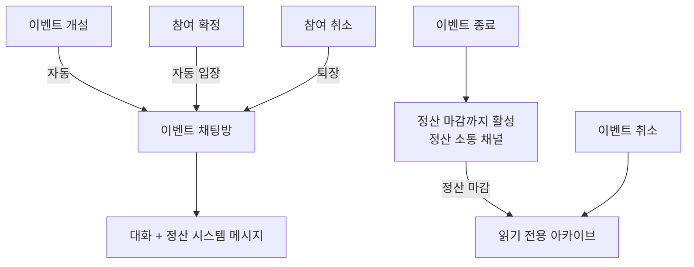

# 정모_번개_채팅 — wireflow (lo-fi)

```mermaid
flowchart TD
  C[이벤트 개설] -->|자동| R[이벤트 채팅방]
  J[참여 확정] -->|자동 입장| R
  X[참여 취소] -->|퇴장| R
  R --> T[대화 + 정산 시스템 메시지]
  E[이벤트 종료] --> A[정산 마감까지 활성<br/>정산 소통 채널]
  A -->|정산 마감| RO[읽기 전용 아카이브]
  CC[이벤트 취소] --> RO
```
