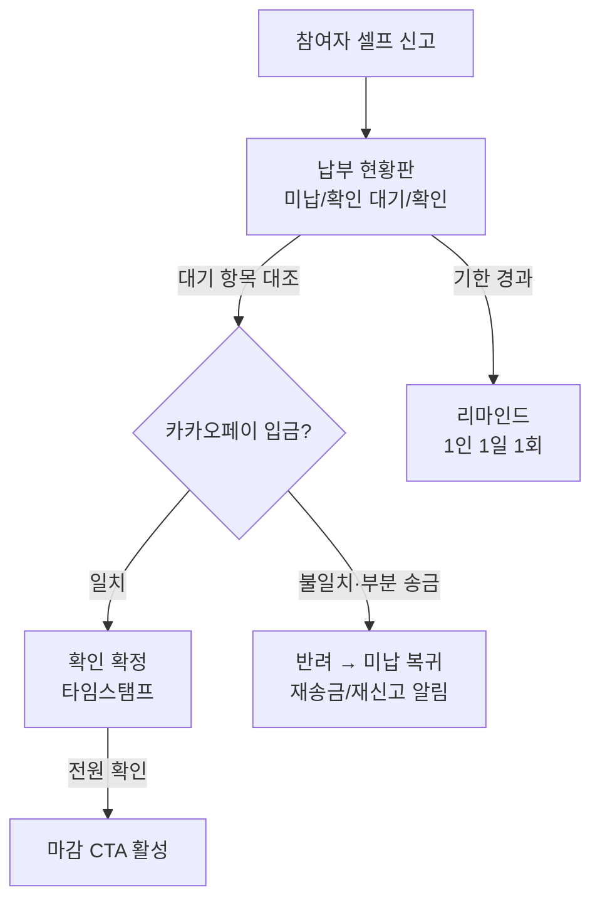

# 납부_추적 — wireflow (lo-fi)

```mermaid
flowchart TD
  B[납부 현황판<br/>미납/확인 대기/확인]
  SN[참여자 셀프 신고] --> B
  B -->|대기 항목 대조| M{카카오페이 입금?}
  M -->|일치| OK[확인 확정<br/>타임스탬프]
  M -->|불일치·부분 송금| RJ[반려 → 미납 복귀<br/>재송금/재신고 알림]
  B -->|기한 경과| RM[리마인드<br/>1인 1일 1회]
  OK -->|전원 확인| CL[마감 CTA 활성]
```
