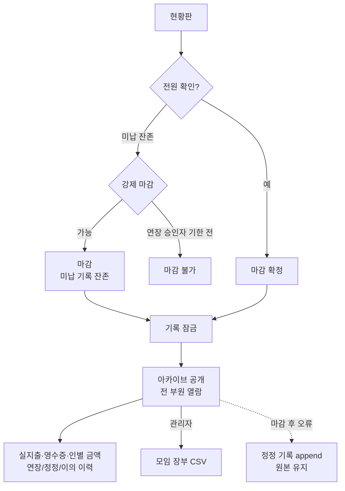

# 정산_마감 — wireflow (lo-fi)

```mermaid
flowchart TD
  B[현황판] --> Q{전원 확인?}
  Q -->|예| CL[마감 확정]
  Q -->|미납 잔존| FC{강제 마감} -->|연장 승인자 기한 전| LK[마감 불가]
  FC -->|가능| CL2[마감<br/>미납 기록 잔존] --> LOCK
  CL --> LOCK[기록 잠금] --> AR[아카이브 공개<br/>전 부원 열람]
  AR --> V[실지출·영수증·인별 금액<br/>연장/정정/이의 이력]
  AR -->|관리자| CSV[모임 장부 CSV]
  AR -.->|마감 후 오류| AP[정정 기록 append<br/>원본 유지]
```
