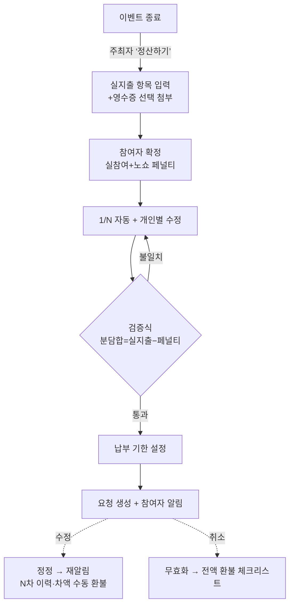

# 정산_만들기 — wireflow (lo-fi)

```mermaid
flowchart TD
  E[이벤트 종료] -->|주최자 ‘정산하기’| F[실지출 항목 입력<br/>+영수증 선택 첨부]
  F --> P[참여자 확정<br/>실참여+노쇼 페널티]
  P --> N[1/N 자동 + 개인별 수정]
  N --> V{검증식<br/>분담합=실지출−페널티} -->|불일치| N
  V -->|통과| DL[납부 기한 설정] --> GO[요청 생성 + 참여자 알림]
  GO -.->|수정| ED[정정 → 재알림<br/>N차 이력·차액 수동 환불]
  GO -.->|취소| CX[무효화 → 전액 환불 체크리스트]
```
