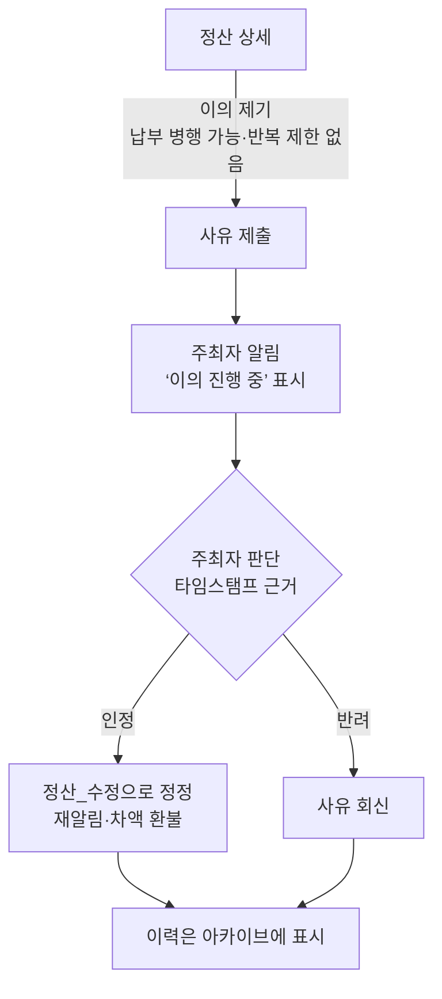

# 정산_이의 — wireflow (lo-fi)

```mermaid
flowchart TD
  D[정산 상세] -->|이의 제기<br/>납부 병행 가능·반복 제한 없음| S[사유 제출] --> N[주최자 알림<br/>‘이의 진행 중’ 표시]
  N --> R{주최자 판단<br/>타임스탬프 근거}
  R -->|인정| FIX[정산_수정으로 정정<br/>재알림·차액 환불]
  R -->|반려| RP[사유 회신]
  FIX & RP --> AR[이력은 아카이브에 표시]
```
