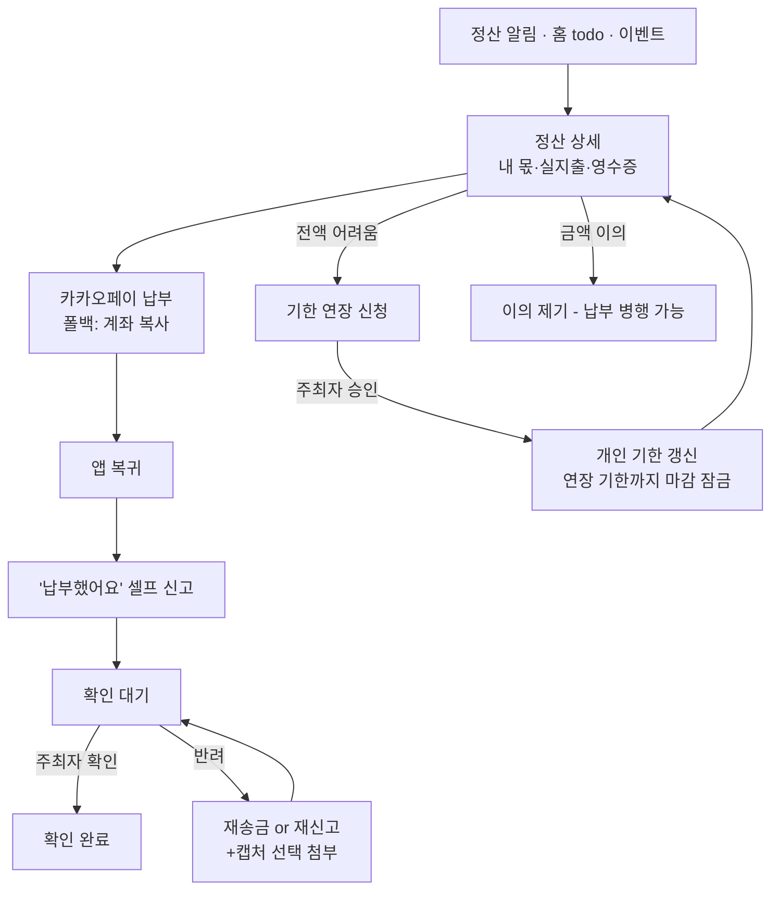

# 회비_납부 — wireflow (lo-fi)

```mermaid
flowchart TD
  IN[정산 알림 · 홈 todo · 이벤트] --> D[정산 상세<br/>내 몫·실지출·영수증]
  D --> PAY[카카오페이 납부<br/>폴백: 계좌 복사] --> BK[앱 복귀] --> SN['납부했어요' 셀프 신고] --> W[확인 대기]
  W -->|주최자 확인| OK[확인 완료]
  W -->|반려| RE[재송금 or 재신고<br/>+캡처 선택 첨부] --> W
  D -->|전액 어려움| EX[기한 연장 신청] -->|주최자 승인| ND[개인 기한 갱신<br/>연장 기한까지 마감 잠금] --> D
  D -->|금액 이의| OBJ[이의 제기 - 납부 병행 가능]
```
