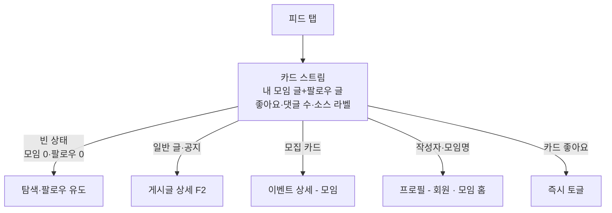
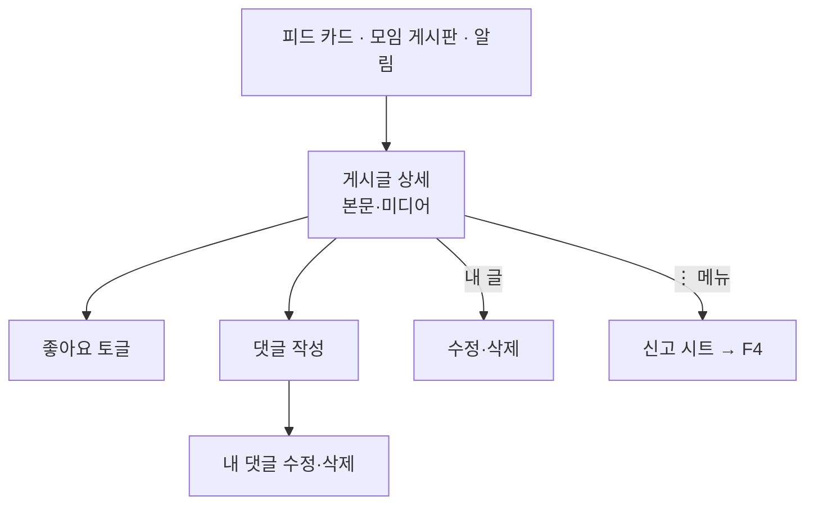
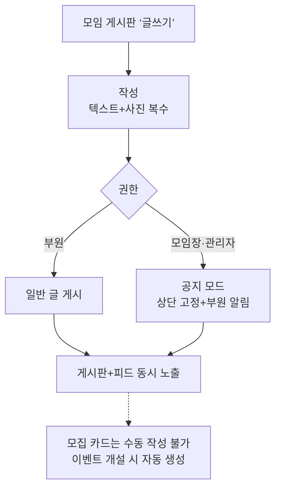
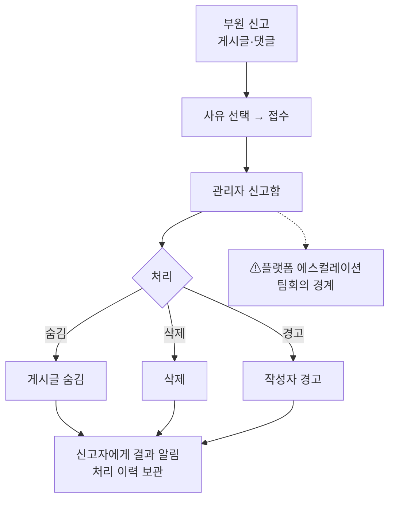

# 피드 도메인 — wireflow (lo-fi · F1~F4)

## F1. 피드 메인

```mermaid
flowchart TD
  T[피드 탭] --> F[카드 스트림<br/>내 모임 글+팔로우 글<br/>좋아요·댓글 수·소스 라벨]
  F -->|빈 상태<br/>모임 0·팔로우 0| E[탐색·팔로우 유도]
  F -->|일반 글·공지| PD[게시글 상세 F2]
  F -->|모집 카드| EV[이벤트 상세 - 모임]
  F -->|작성자·모임명| PR[프로필 - 회원 · 모임 홈]
  F -->|카드 좋아요| LK[즉시 토글]
```

## F2. 게시글 상세 (피드·게시판 공용)

```mermaid
flowchart TD
  IN[피드 카드 · 모임 게시판 · 알림] --> D[게시글 상세<br/>본문·미디어]
  D --> L[좋아요 토글]
  D --> C[댓글 작성] --> CE[내 댓글 수정·삭제]
  D -->|내 글| ME[수정·삭제]
  D -->|⋮ 메뉴| R[신고 시트 → F4]
```

## F3. 글 작성·편집

```mermaid
flowchart TD
  B[모임 게시판 ‘글쓰기’] --> W[작성<br/>텍스트+사진 복수]
  W --> P{권한}
  P -->|부원| PO[일반 글 게시]
  P -->|모임장·관리자| NT[공지 모드<br/>상단 고정+부원 알림]
  PO & NT --> X[게시판+피드 동시 노출]
  X -.-> AUTO[모집 카드는 수동 작성 불가<br/>이벤트 개설 시 자동 생성]
```

## F4. 신고·모더레이션

```mermaid
flowchart TD
  U[부원 신고<br/>게시글·댓글] --> S[사유 선택 → 접수]
  S --> IB[관리자 신고함]
  IB --> A{처리}
  A -->|숨김| H1[게시글 숨김]
  A -->|삭제| H2[삭제]
  A -->|경고| H3[작성자 경고]
  H1 & H2 & H3 --> N[신고자에게 결과 알림<br/>처리 이력 보관]
  IB -.-> ESC[⚠플랫폼 에스컬레이션<br/>팀회의 경계]
```
