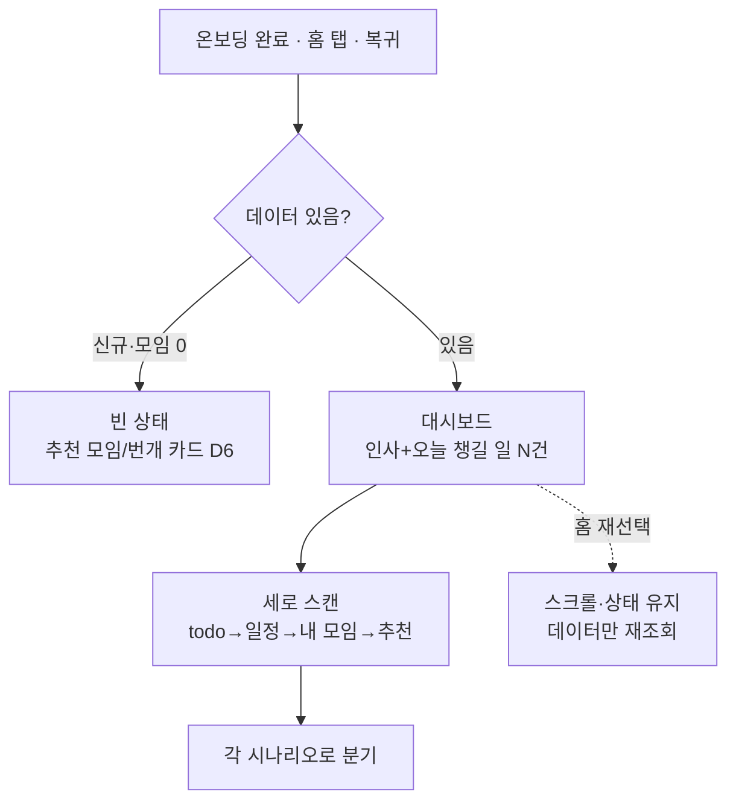

# 홈_대시보드 — wireflow (lo-fi)

```mermaid
flowchart TD
  IN[온보딩 완료 · 홈 탭 · 복귀] --> Q{데이터 있음?}
  Q -->|신규·모임 0| E[빈 상태<br/>추천 모임/번개 카드 D6]
  Q -->|있음| H[대시보드<br/>인사+오늘 챙길 일 N건]
  H --> S[세로 스캔<br/>todo→일정→내 모임→추천]
  S --> B[각 시나리오로 분기]
  H -.->|홈 재선택| K[스크롤·상태 유지<br/>데이터만 재조회]
```
