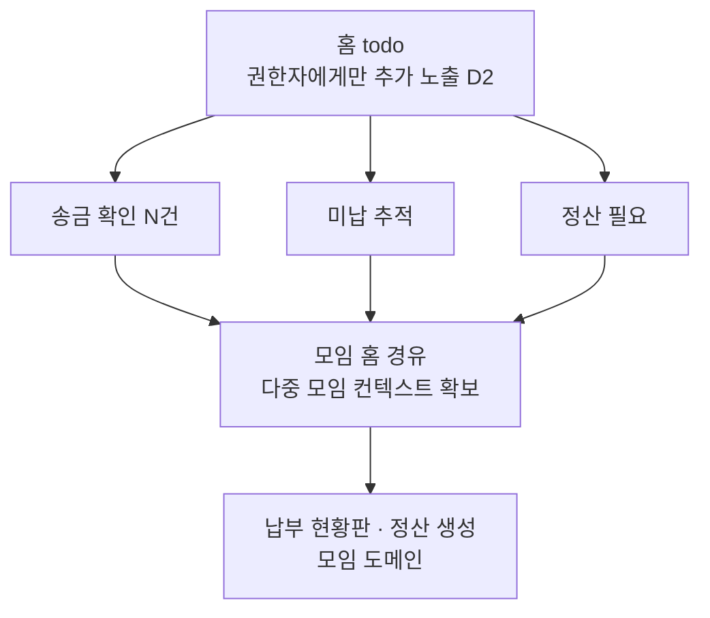

# 총무_운영_진입 — wireflow (lo-fi)

```mermaid
flowchart TD
  H[홈 todo<br/>권한자에게만 추가 노출 D2] --> C1[송금 확인 N건]
  H --> C2[미납 추적]
  H --> C3[정산 필요]
  C1 & C2 & C3 --> GH[모임 홈 경유<br/>다중 모임 컨텍스트 확보]
  GH --> M[납부 현황판 · 정산 생성<br/>모임 도메인]
```
