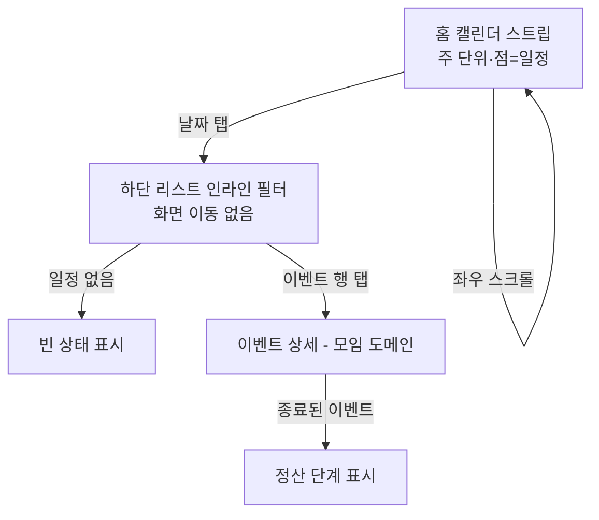

# 다가오는_일정 — wireflow (lo-fi)

```mermaid
flowchart TD
  H[홈 캘린더 스트립<br/>주 단위·점=일정] -->|좌우 스크롤| H
  H -->|날짜 탭| F[하단 리스트 인라인 필터<br/>화면 이동 없음]
  F -->|일정 없음| E[빈 상태 표시]
  F -->|이벤트 행 탭| D[이벤트 상세 - 모임 도메인]
  D -->|종료된 이벤트| S[정산 단계 표시]
```
