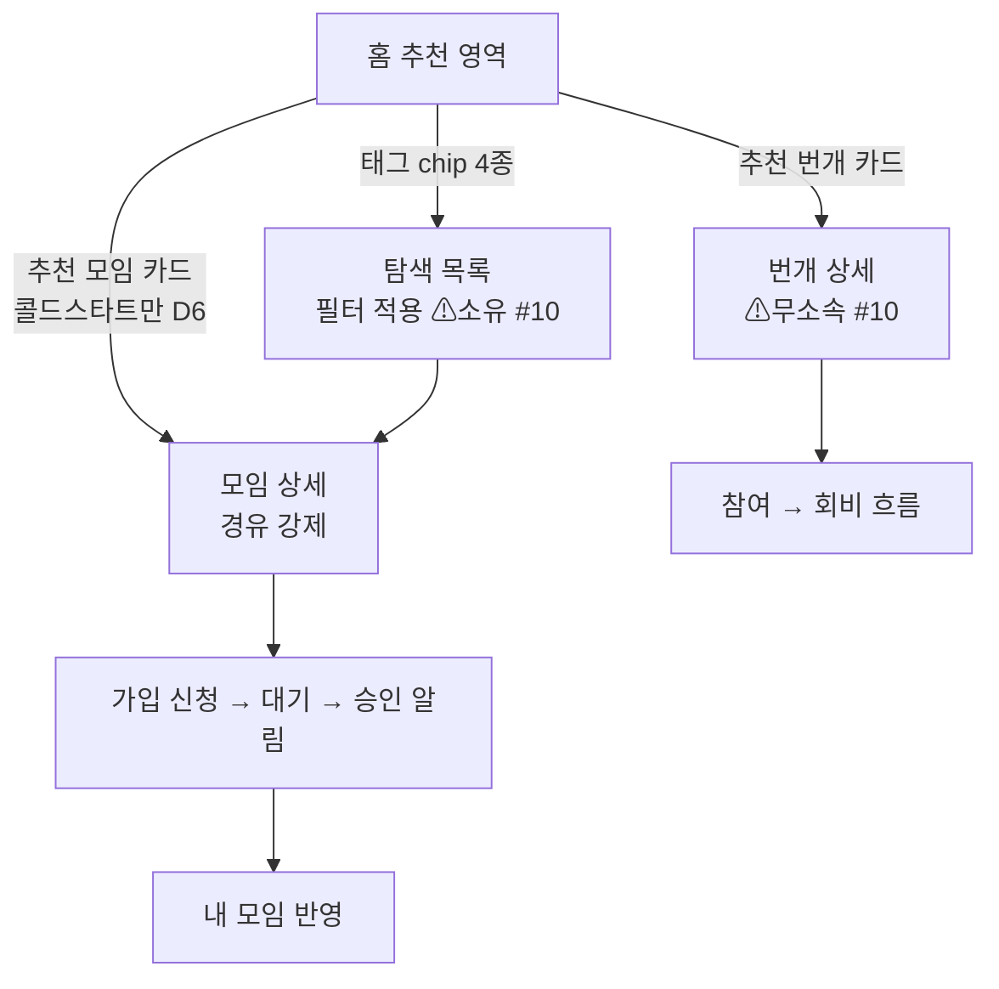

# 모임_번개_탐색 — wireflow (lo-fi)

```mermaid
flowchart TD
  H[홈 추천 영역] -->|태그 chip 4종| L[탐색 목록<br/>필터 적용 ⚠소유 #10]
  H -->|추천 모임 카드<br/>콜드스타트만 D6| D[모임 상세<br/>경유 강제]
  L --> D
  D --> J[가입 신청 → 대기 → 승인 알림] --> MY[내 모임 반영]
  H -->|추천 번개 카드| BD[번개 상세<br/>⚠무소속 #10] --> P[참여 → 회비 흐름]
```
