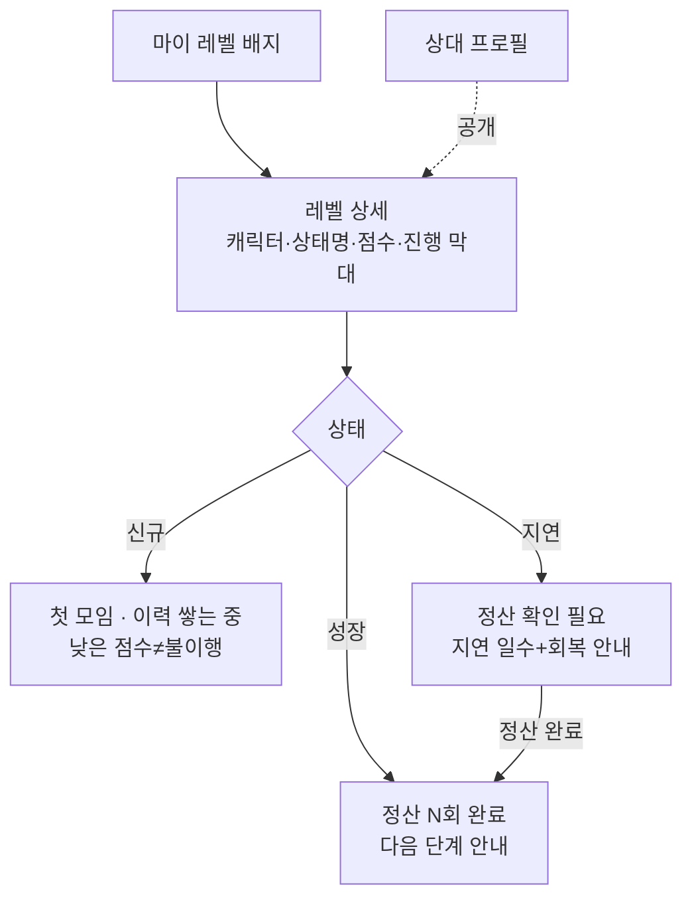

# 모임_레벨 — wireflow (lo-fi)

```mermaid
flowchart TD
  B[마이 레벨 배지] --> D[레벨 상세<br/>캐릭터·상태명·점수·진행 막대]
  D --> S{상태}
  S -->|신규| N[첫 모임 · 이력 쌓는 중<br/>낮은 점수≠불이행]
  S -->|성장| G[정산 N회 완료<br/>다음 단계 안내]
  S -->|지연| L[정산 확인 필요<br/>지연 일수+회복 안내] -->|정산 완료| G
  O[상대 프로필] -.->|공개| D
```
