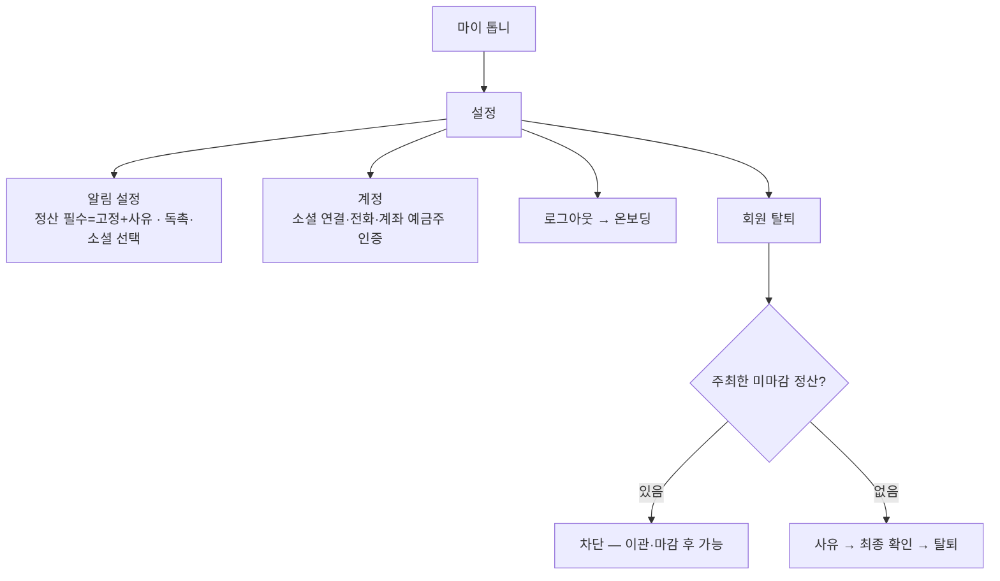

# 설정 — wireflow (lo-fi)

```mermaid
flowchart TD
  MY[마이 톱니] --> S[설정]
  S --> N[알림 설정<br/>정산 필수=고정+사유 · 독촉·소셜 선택]
  S --> A[계정<br/>소셜 연결·전화·계좌 예금주 인증]
  S --> LO[로그아웃 → 온보딩]
  S --> W[회원 탈퇴] --> Q{주최한 미마감 정산?}
  Q -->|있음| B[차단 — 이관·마감 후 가능]
  Q -->|없음| CF[사유 → 최종 확인 → 탈퇴]
```
