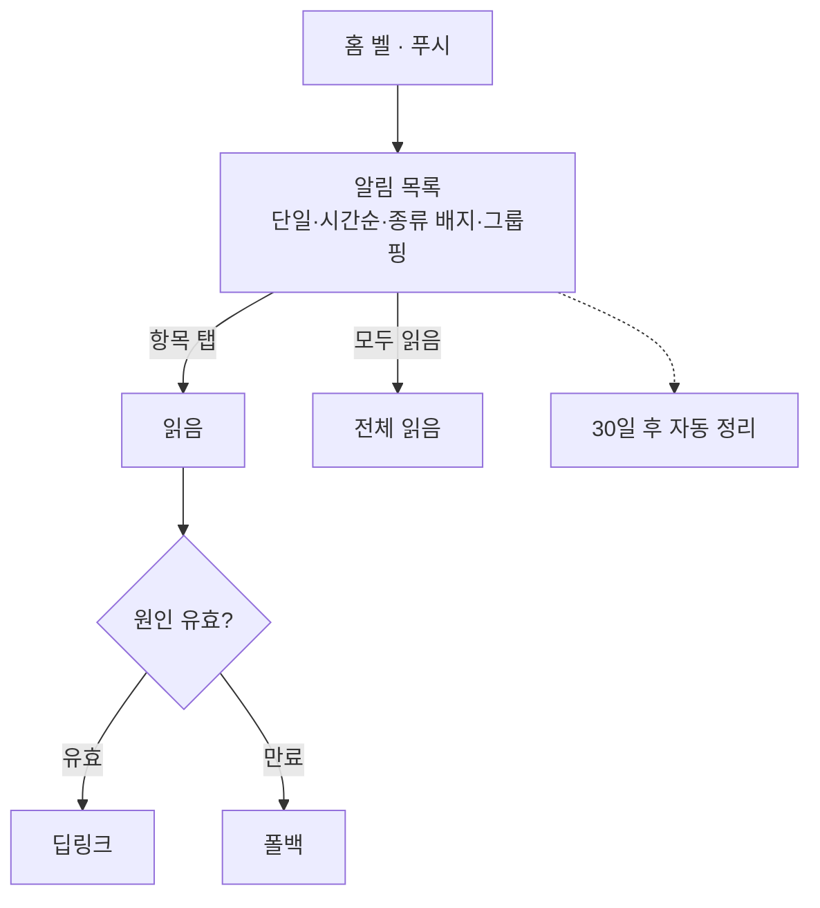

# 알림_센터 — wireflow (lo-fi)

```mermaid
flowchart TD
  IN[홈 벨 · 푸시] --> N[알림 목록<br/>단일·시간순·종류 배지·그룹핑]
  N -->|항목 탭| RD[읽음] --> DL{원인 유효?}
  DL -->|유효| GO[딥링크]
  DL -->|만료| FB[폴백]
  N -->|모두 읽음| ALL[전체 읽음]
  N -.-> D30[30일 후 자동 정리]
```
