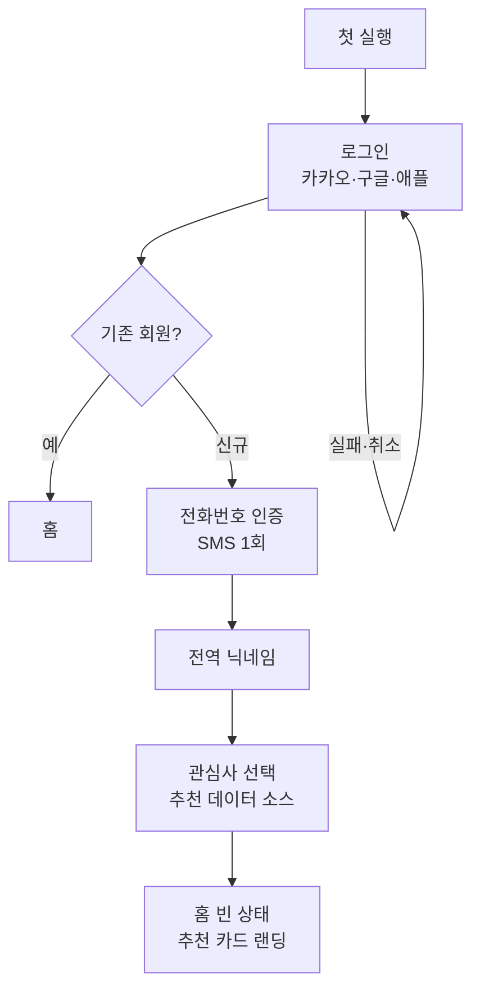

# 온보딩 — wireflow (lo-fi)

```mermaid
flowchart TD
  S[첫 실행] --> L[로그인<br/>카카오·구글·애플]
  L --> Q{기존 회원?}
  Q -->|예| H[홈]
  Q -->|신규| P[전화번호 인증<br/>SMS 1회] --> N[전역 닉네임] --> I[관심사 선택<br/>추천 데이터 소스] --> E[홈 빈 상태<br/>추천 카드 랜딩]
  L -->|실패·취소| L
```
